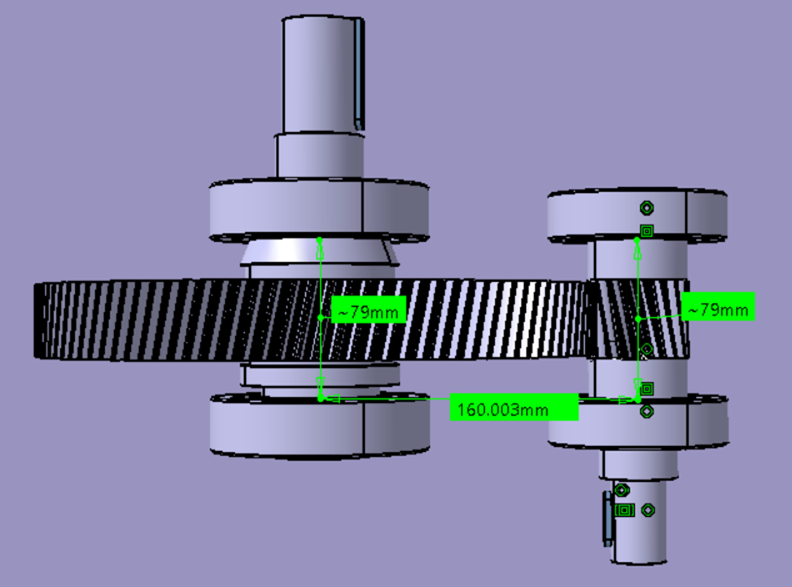
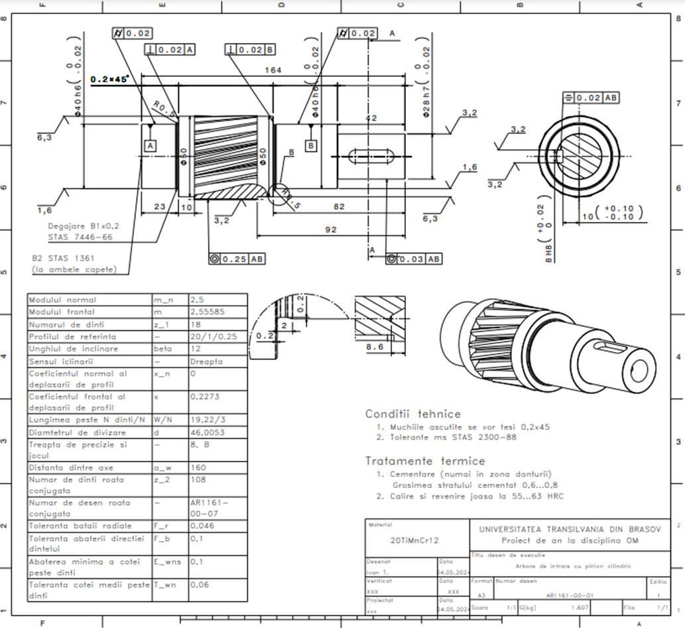

# Cylindrical Gear Reducer - CATIA Model

## Project Overview
This project involves the **design and modeling of a single-stage cylindrical gear reducer** using CATIA. It covers all essential subassemblies, including **shafts, gears, housing, and auxiliary components** (breather plug, oil level sight glass). The project also includes technical documentation, such as **calculations, memos, assembly drawings, and execution drawings**.

## Features
- **3D Modeling in CATIA**: Components and subassemblies were designed with a focus on mechanical functionality and manufacturability.
- **Structural and Kinematic Analysis**: Verifications of **shafts, bearings, and gears** were performed.
- **Technical Calculations**: Gear meshing, forces, and stresses were analyzed to ensure structural integrity.
- **Final Documentation**: Includes detailed **assembly drawings and execution drawings**.

## Images
### 3D Model of the Gear Reducer

### Gear Subassembly

### Upper Housing Subassembly

### Lower Housing Subassembly

### Technical Drawing - Gear Reducer

### Technical Drawing - Cylindrical Gear Wheel

### Technical Drawing - Input Shaft With Cylindrical Pinion

### Simulation of gear engagement and continuity verification
<table>
  <tr>
    <td align="center">
      
       
      <em>
        Entry into engagement of tooth pair n;  
        T₁A = 0.834 mm, pb = 7.549 mm:  
        rot₁ = -17.637°  
      </em>
    </td>
    <td align="center">
      
       
      <em>
        Exit from engagement of tooth pair n+1;  
        T₁B = 13.58 mm:  
        rot₁ = -4.099°  
      </em>
    </td>
  </tr>
  <tr>
    <td align="center">
      
       
      <em>
        Entry into engagement of tooth pair n-1;  
        T₁A = 0.935 mm, pb = 7.55 mm:  
        rot₁ = 6.5°  
      </em>
    </td>
    <td align="center">
      
       
      <em>
        Exit from engagement of tooth pair n;  
        T₁B = 13.58 mm:  
        rot₁ = -4.099°  
      </em>
    </td>
  </tr>
</table>

## Tools & Software Used
- **CATIA** – 3D modeling and simulations
- **MDESIGN** – Shaft and bearing verifications
